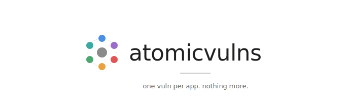

<p align="center">
  
</p>

<!-- Badges — placeholders iniciais; mais virão (CI, coverage, release, etc.) -->
[](./LICENSE)


> ⚠️ **Código intencionalmente vulnerável. Rode apenas localmente. Nunca exponha à internet ou a uma rede compartilhada.**

**Este README em outros idiomas:** [English](./README.md)

## O que é o atomicvulns?

`atomicvulns` é uma coleção de aplicações web *atômicas* — cada uma minúscula, isolada e focada em **uma única vulnerabilidade** do OWASP Top 10. Todo átomo entrega a app vulnerável, a versão corrigida, um diff comentado entre as duas e um walkthrough prático do exploit.

Este projeto **não** é mais um DVWA ou Juice Shop. Apps vulneráveis monolíticas já existem. O diferencial do atomicvulns é o *atomismo radical*: uma app por falha, rápida de ler, rápida de explorar. Você mapeia código causal → request/response → exploit sem precisar entender uma aplicação inteira antes.

## Público-alvo

Estudantes de pentest e de AppSec que já sabem o básico de HTTP e terminal, usam (ou estão aprendendo a usar) **Burp Suite**, e querem um laboratório focado onde cada exercício é curto o suficiente para terminar de uma sentada. O material é escrito para quem vai aplicar isso na carreira de pentest — Burp é a ferramenta principal, a UI é só contexto.

## Rodando um átomo

Cada átomo vive em sua própria pasta sob `atoms/A0X-<categoria>/<atom-id>/` e vem com um `docker-compose.yml`. Um script wrapper na raiz, `./atom`, dirige os átomos:

```bash
./atom list                 # lista todos os átomos disponíveis
./atom up <atom-id>         # sobe o par vulnerable + fixed
./atom down <atom-id>       # para e remove os containers
./atom doctor               # checagem básica do ambiente local
```

Por exemplo, para subir o primeiro átomo:

```bash
./atom up sqli-union-basic
# vulnerable → http://127.0.0.1:8001
# fixed      → http://127.0.0.1:8101
```

Todo átomo faz bind apenas em `127.0.0.1`. **Nunca** altere isso — essas apps são intencionalmente quebradas.

## Documentação

- **[ROADMAP.md](./ROADMAP.md)** — plano ordenado de implementação e checklist de progresso.
- **[CLAUDE.md](./CLAUDE.md)** — *para contribuidores:* briefing do projeto, convenções e regras de base.

## Licença

Publicado sob a [Licença MIT](./LICENSE). Se você forkar este repositório para material didático, atribuição é obrigatória.
